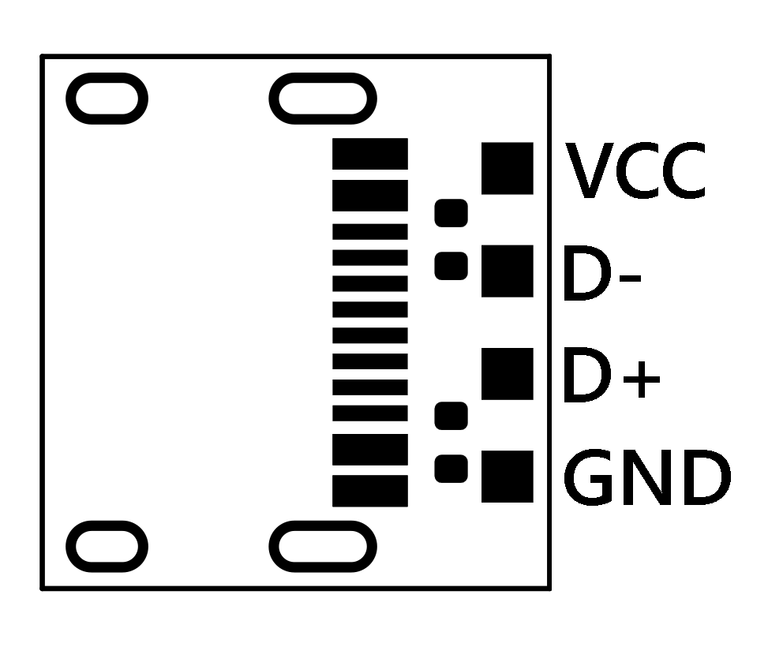
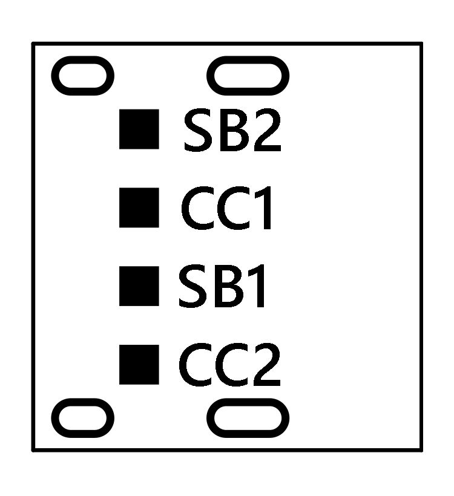

#  µC USB 2.0 Type C Breakout Board
I like USB C, You like USB C. We all like USB C.  
But there's one thing missing from all the cheap USB Type C breakout boards on the market, and that is support for USB C to C cables.  
This board solves that by following the basic spec and inclusing the two 5k1 pull-down resistors. It also maintains a small and light footprint to make integration easy. Finally, it breaks out all the pins on the type C 2.0 connector, which includes: VCC, GND, D+, D-, CC1, CC2, SBU1, and SBU2.

## Pinout

## Ordering
Download the Gerber.zip in the root of this repository, and ipload it to your board house of choice.  
Assemble using
- 1x Type-C-31-M-12
- 2x 5k1 resistor [package 0402]
